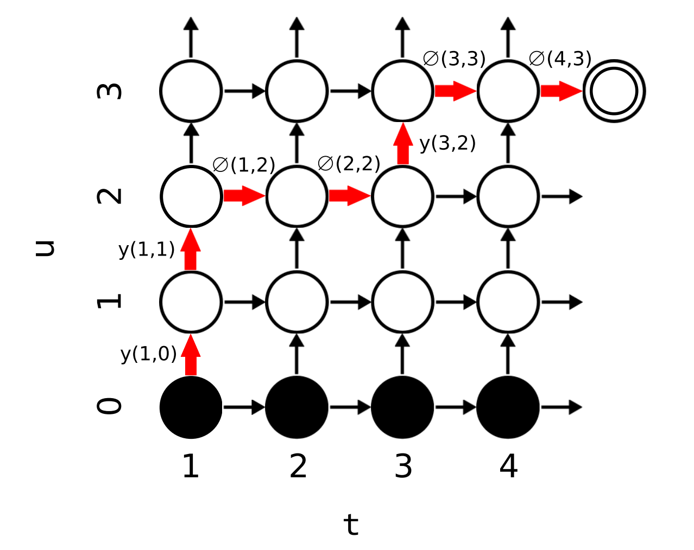
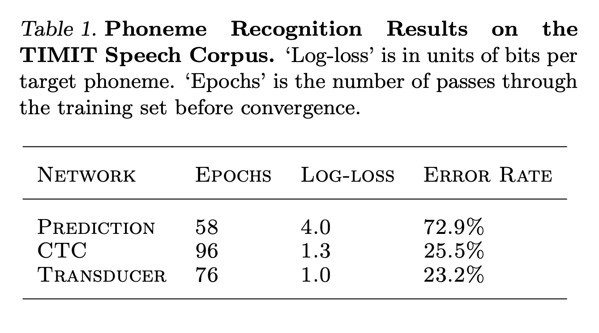

<!--  -->
<link rel="stylesheet" href="https://cdn.jsdelivr.net/npm/katex@0.12.0/dist/katex.min.css" integrity="sha384-AfEj0r4/OFrOo5t7NnNe46zW/tFgW6x/bCJG8FqQCEo3+Aro6EYUG4+cU+KJWu/X" crossorigin="anonymous">

- [Sequence Transduction with Recurrent Neural Networks](https://arxiv.org/abs/1211.3711)

# Abstract

---

- ML task는 입력 sequence를 출력 sequence로 변환하는 모델(transform or transduction)로 표현할 수 있음.
- RNN는 sequence를 학습할 수 있는 강력한 아키텍쳐지만 입력과 출력의 alignment가 맞아야 하며, 이는 어렵고 심지어는 출력의 길이를 정하는 것조차 어려울 때가 많음.
- end-to-end로 학습할 수 있는 확률적 sequence transduction 시스템을 RNN을 이용해 개발함.

# Introduction

---

- sequence transducer를 만들 때 순차적이고 가변적인 정보를 왜곡에 robust하게 만드는 것은 어렵다. (예를 들면 음성인식에서 다른 사람 목소리나 노이즈 등에 영향을 받지 않도록)
- RNN은 유용하지만 RNN은 입력과 출력 Sequence의 길이가 같다. 그래서 Input과 Output의 alignment가 맞는 문제들에서 주로 사용되었다.
- 저자들은 입력 sequence 길이와 무관한 모든 길이의 출력 sequence에 대한 확률 분포를 구하길 원했다.
- CTC는 RNN을 이용하여 "입력 Sequence의 길이 ≥ 출력 Sequence의 길이"를 만족하는 모든 sequence의 확률 분포를 구할 수 있었다. 하지만 TTS 등은 반대로 출력 Sequence의 길이가 더 길어지므로 저자들은 CTC를 확장해 입력과 출력의 모든 길이에 대한 분포를 구할 수 있도록 모델링했다.
- 또한 CTC와 다르게 Input-output과 output-output의 의존성을 모두 고려할 수 있도록 모델링했다.

# Recurrent Neural Network Transducer

---

모델의 입출력은 다음과 같이 표현할 것이다.

$$\mathcal{X}$$: input space

$$\mathcal{X}^*$$: input space $$\mathcal{X}$$에 대해, 존재할 수 있는 모든 시퀸스의 집합

$$x = (x_1, x_2, \ldots, x_T)$$는 길이 $$T$$의 입력 시퀸스이다. $$(x \in \mathcal{X^*})$$

 

$$\mathcal{Y}$$: output space

$$\mathcal{Y}^*$$: output space $$\mathcal{Y}$$에 대해, 존재할 수 있는 모든 시퀸스의 집합

$$y = (y_1, y_2, \ldots, y_U)$$는 길이 $$U$$의 출력 시퀸스이다. $$(y \in \mathcal{Y}*)$$

- 음성인식을 예로 들면 입력벡터 $$x_t$$는 일반적으로 MFC 계수의 벡터가 될 것이다. 논문에서는 output space는 이산적이라고 가정했다. 하지만 이 방법은 연속적인 output space로 확장이 가능하다.

 

$$\bar\mathcal{Y}$$: $$\mathcal{Y} \cup \varnothing$$

- $$\varnothing$$은 null output를 의미한다. null output의 직관적인 의미로는 "아무것도 출력하지 않음"이다.
- 시퀸스 $$(y_1, \varnothing, \varnothing, y_2, \varnothing, y_3) \in \bar\mathcal{Y}^*$$ 는 $$(y_1, y_2, y_3) \in \mathcal{Y}$$에 대응된다.

 $$a \in \bar\mathcal{Y}^*$$는 alignments로, 입력과 출력 시퀸스 사이의 alignment를 뜻한다.

$$\mathcal{B}: \bar\mathcal{Y}^* \rightarrow \mathcal{Y}^*$$ 는 null symbol을 제거하는 함수이다.

$$x$$가 주어졌을 때, 출력 $$y$$가 정답일 확률은 아래와 같다.

$$Pr(y \in \mathcal{Y^*}|x) = \sum_{a\in\mathcal{B}^{-1}(y)} Pr(a|x)$$

- 의미적으로는 null output를 제거했을 때 정답이 되는 시퀸스의 등장 확률을 모두 더한다는 뜻이다.

 
모델은 transcription 네트워크와 prediction 네트워크로 구성되어있다.

transcription 네트워크 $$\mathcal{F}$$는 input 시퀸스 $$x$$를 입력받고 트랜스크립션 $$f = (f_1, \ldots, f_T)$$ 를 출력한다.

prediction네트워크 $$\mathcal{G}$$는 output 시퀸스 $$y$$를 입력받고 예측 벡터 $$g = (g_0, g_1, \ldots, g_U)$$를 출력한다.

## Prediction Network

Prediction 네트워크 $$\mathcal{G}$$는 하나의 RNN input 레이어, output 레이어 그리고 hidden 레이어로 구성된다.

그냥 RNN 네트워크인데 특별한 점은 $$\hat{y} = (\varnothing, y_1, \ldots, y_U)$$ 처럼 맨 앞에 $$\varnothing$$를 붙이는 것이다. 그래서 Sequence 길이는 $$U+1$$이 된다.

- one-hot 인코딩 사용
- RNN 계열 중 LSTM을 사용
- 앞서 예측한 글자에 기반해 다음 글자를 예측하는 역할을 수행한다. (output-output dependency)

## Transcription Network

Transcription 네트워크 $$\mathcal{F}$$는 Bi-RNN과 2 hidden layer로 구성되어있다.

- sequence 전체를 보고 추론하기 위해 Bidirectional 사용
- Transcription 네트워크의 출력 차원은 $$K+1$$로 prediction 네트워크와 동일하다. (음성인식에서는 의미상 $$K$$= 발음기호 종류의 개수)
- 입력 신호에 기반해 발음 기호를 예측하는 역할을 수행한다. (input-output dependency)

## Output Distribution

$$1 \le t \le T$$를 만족하는 transcription 벡터 $$f_t$$와 $$0 \le u \le U$$를 만족하는 prediction 벡터 $$g_u$$ 그리고 레이블 $$k \in \bar\mathcal{Y}$$ 가 주어졌을 때, 출력의 확률 밀도함수를 아래와 같이 정의한다.

(위첨자 $$k$$는 벡터의 $$k^{th}$$ 요소라는 의미)

$$h(k,t,u)  = exp(f_t^k + g_u^k)$$

$$Pr(k \in \bar\mathcal{Y} | t, u) = \frac{h(k,t,u)}{\sum_{k^\prime\in \bar\mathcal{Y}}h(k^\prime, t, u)}$$

- 쉽게 표현하면 $$t, u$$에서 $$k$$번째 발음기호가 나올 확률이라고 생각하면 됨.
- 여기서 중요한 점은 prediction함수와 transcription 함수의 결과를 더해서 추론한다는 점. CTC나 전통적인 encoder-decoder 구조와도 차이가 있다.

$$y(t,u) \equiv Pr(y_{u+1}|t,u)$$

$$\varnothing(t,u) \equiv Pr(\varnothing|t,u)$$

- 쉽게 말하면 $$y(t,u)$$는 $$t,u$$에서 다음 $$u+1$$번째 정답 발음기호를 맞출 확률이며, $$\varnothing(t,u)$$는 $$t,u$$에서 다음에 null을 출력할 확률(=여기까지만 출력하고 $$t+1$$로 넘어갈 확률)을 뜻함.

 

forward 변수 $$\alpha(t,u)$$를 $$\bm{f}_{[1:t]}$$동안에 $$\bm{y}_{[1:u]}$$를 출력할 확률로 정의하면, 모든 $$1 \le t \le T$$와 $$1 \le u \le U$$에 대해 $$\alpha$$는 다음과 같이 재귀적으로 계산할 수 있다.

$$\alpha(t,u) = \alpha(t-1, u)\varnothing(t-1, u) + \alpha(t,u-1)y(t,u-1)$$

- 의미상으로 왼쪽항은 $$t-1$$시점에 $$u$$까지 출력하고 다음에는 null을 출력할 확률이며,
오른쪽 항은 $$t$$시점에 $$u-1$$까지 출력하고 한번 더 $$y$$를 출력할 확률이다.
- $$\alpha(1,0) = 1$$
- 아래 그림 상에서 오른쪽 화살표의 의미가 왼쪽 항, 위쪽 화살표의 의미가 오른쪽 항이다.

- 전체 출력 sequence의 확률은 마지막 노드에서의 확률과 같다.

    $$Pr(\bm{y|x}) = \alpha(T,U)\varnothing(T,U)$$

    - 의미상으로는 $$T$$시점에 $$U$$까지 출력하고, 그 다음은 null을 출력해서 끝날 확률을 뜻한다.

backward 변수 $$\beta(t,u)$$는 $$\alpha$$와 비슷하지만 거꾸로 끝에서부터 확률을 구한다. $$\beta(t,u)$$는  $$\bm{f}_{[t:T]}$$동안에 $$\bm{y}_{[y+1:U]}$$를 출력할 확률이다.

$$\beta(t,u)=\beta(t+1,u)\varnothing(t,u)+\beta(t,u+1)y(t,u)$$

$$\beta(T,U)=\varnothing(T,U)$$

- 결과적으로 $$\alpha(t,u)\beta(t,u)$$는 모든 각각의 점 $$(t,u)$$에서 "step $$t$$에서 $$y_u$$를 출력했을 때, 완성된 전체 sequence를 출력할 확률"을 뜻하게 된다. 직관적인 의미로는 "$$(t,u)$$ 노드를 꼭 포함하여 전체 sequence를 완성할 수 있는 확률"이다.

## Training

입력 sequence $$\bm{x}$$와 목표 sequence $$\bm{y}$$가 주어졌을 때 일반적으로 모델을 학습시키는 방법은 목표 sequence의 log-loss
$$\mathcal{L} = -\ln \Pr(\bm{y^*|x})$$ 를 최소화하는 것이다.

$$\Pr(\bm{y^*}|\bm{x})$$은 top-left 에서 bottom-right로 가는 어떤 대각선을 고르면 해당 대각선 상의 노드들의
$$\alpha(t,u)\beta(t,u)$$ 값의 합과 같다.

$$\forall n: 1 \le n \le U+T$$

$$\Pr(\bm{y^*|x})=\sum_{(t,u):t+u=n} \alpha(t,u)\beta(t,u)$$

를 만족한다.

- 의미상으로는 $$\alpha(t,u)\beta(t,u)$$가 "$$(t,u)$$ 노드를 꼭 포함하여 전체 sequence를 완성할 수 있는 확률" 이기 때문에 top-left, bottom-right 대각선을 하나 선택하면 목표 sequence를 완성하기 위해서는 무조건 해당 노드들 중에 하나를 지나야만 하고, 하나의 path는 해당 노드들 중에 하나만을 지나기 때문에 각 노드들의 확률를 더하면 전체 확률이 된다.

## Testing

- Testing을 할 때는 beam-search 기법을 사용한다.

# Experimental Results

---

- TIMIT 데이터셋을 train 셋은 3696개, test 셋은 192개로, 39종류의 음성기호로 전사된 발화를 사용했다.
- 입력은 26채널 mel-frequency filter bank를 사용했다.

- 전체적으로 transducer는 CTC보다 조금 나은 성능을 보여줬지만 이는 TIMIT데이터셋이 너무 작아서 그런 걸로 보임.
- 더 큰 데이터셋에서 더 커다란 개선을 보일 것으로 기대함.

# Conclusion

---

- 저자들은 두 개의 RNN 네트워크로 구성된 일반적인 Transducer를 개발했다.
- 이 구조는 음성학적인 정보와 언어학적인 정보를 모두 고려하여 추론할 수 있다.
- 앞으로 이 Transducer를 음성인식 외에도 손글씨 인식이나 번역 등 다양한 transduction problem에 적용해볼 생각이다.
